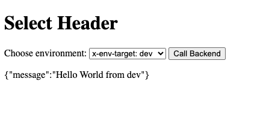
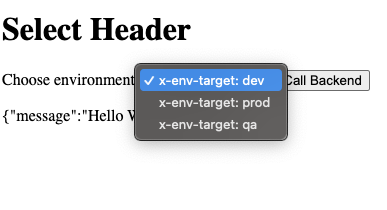

# ossm-header-routing
Simple demo to show routing based on headers via OSSM

This uses a `ServiceEntry` called `product-api-entry` in the `frontend-ns` namespace. 
  
  
The `VirtualService` named `product-api-routing` evaluates headers when the ServiceEntry is called and routes to an internal service in another namespace based on the header.   

This is for illustrative purposes, but you could use headers to route to `dev`, `test`, `prod` namespaces, for example.


## Prereq-OSSM is installed and configured

See: (OSSM3 Demo SetUp)[https://github.com/bugbiteme/ossm-3-demo]

Apply `istio.yaml` to update it to handle DNS allocation

```bash
oc apply -f istio.yaml
```

Added config:

```yaml
  values:
    meshConfig:
      defaultConfig:
        proxyMetadata:
          ISTIO_META_DNS_AUTO_ALLOCATE: "true"
          ISTIO_META_DNS_CAPTURE: "true"
```

## Deploy Resources

### Deploy Back-End Services

Dev

```bash
oc apply -k backend/overlays/dev
```

Prod

```bash
oc apply -k backend/overlays/prod
```

QA

```bash
oc apply -k backend/overlays/qa
```


### Deploy Front-End Service

```bash
oc apply -k frontend  
```

Sample output:

```bash
namespace/frontend-ns created
service/flask-front-end created
deployment.apps/flask-front-end created
serviceentry.networking.istio.io/product-api-entry created
virtualservice.networking.istio.io/product-api-routing created
route.route.openshift.io/flask-front-end created
pod/curl-test created
```

## Test Header-Based Routing via pod network

This uses a test pod named `curl-test` to ensure header-based routing works

header `dev`

```bash
oc exec -n frontend-ns curl-test -- \
  curl -s -H "x-env-target: dev" \
       http://product-api.internal/hello
```

Output:

```json
{"message":"Hello World from dev"}
```

header `prod`

```bash
oc exec -n frontend-ns curl-test -- \
  curl -s -H "x-env-target: prod" \
       http://product-api.internal/hello
```

Output:

```json
{"message":"Hello World from prod"}
```

header `qa`

```bash
oc exec -n frontend-ns curl-test -- \
  curl -s -H "x-env-target: qa" \
       http://product-api.internal/hello
```

Output:

```json
{"message":"Hello World from qa"}
```

## Test Header-Based Routing via front-end app

The deployed application in the `frontend-ns` namespace is a Python/Flask app

It is currently exposed as a route, but feel free to create an ingress gateway if required

```bash
 oc get routes                                                                      
NAME              HOST/PORT                                                                     
flask-front-end   flask-front-end-frontend-ns.app.<domain>
```

This is a browser based app that allows you to test responses based on headers from a drop-down list





Source code found at `./code/flask`

```python
@app.route("/call-api")
def call_api():
...

    headers = {"x-env-target": env}
...

        response = requests.get("http://product-api.internal/hello", headers=headers) 
        return Response(response.content, status=response.status_code, mimetype="text/plain")
...
```
